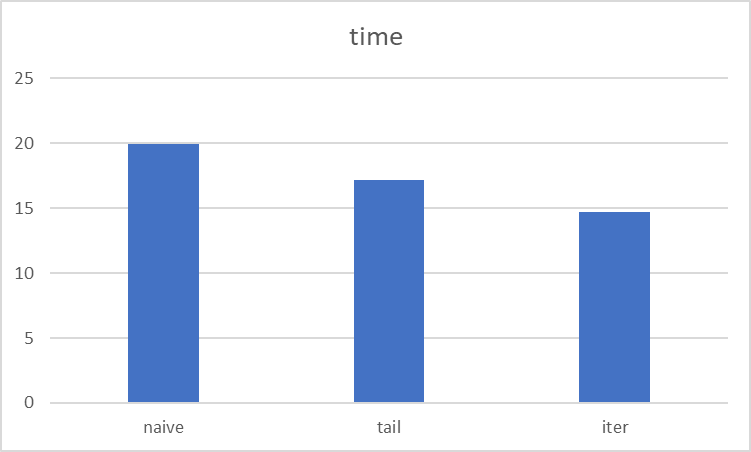

### Task1

I ran the benchmark 5 times on the LCC3 and got the following results for avg time, as expected naive is the slowest, tail recursion is a bit faster and iterative is the fastes with 10.945s on average

| fib   | time    |
|-------|---------|
| naive | 12.732s |
| tail  | 12.626s |
| iter  | 10.945s |



### Task2

i used gprof and compiled it with the -pg flag, the most time was spent in ````luaV_execute```` with 80.37% of the total time which is the main interpreter loop, the profiling results indicate the specific functions that consume the most time, but further analysis is needed to understand why these functions are costly and how they can be optimized

i analyzed it with perf and generated a callgraph but i could not really read more into how it works
