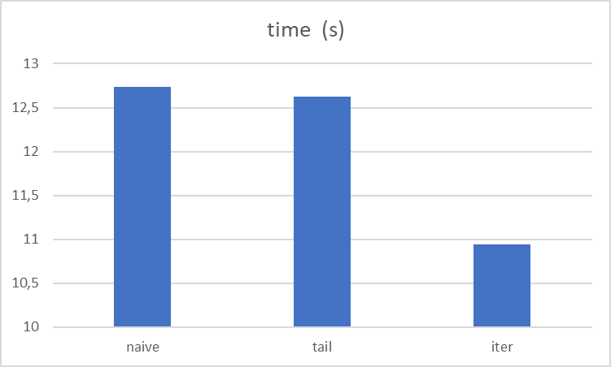

### Task1

I ran the benchmark 5 times on the LCC3 and got the following results for avg time, as expected naive is the slowest, tail recursion is a bit faster and iterative is the fastes with 14.739s on average

### Task2
