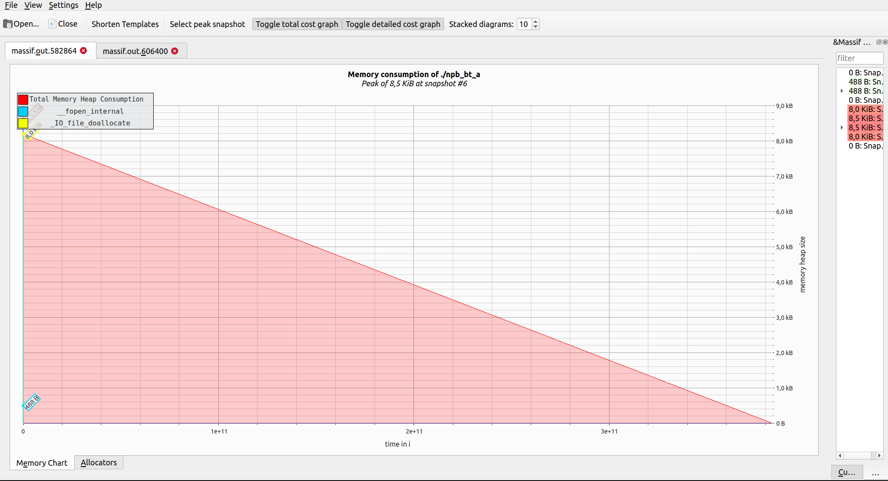
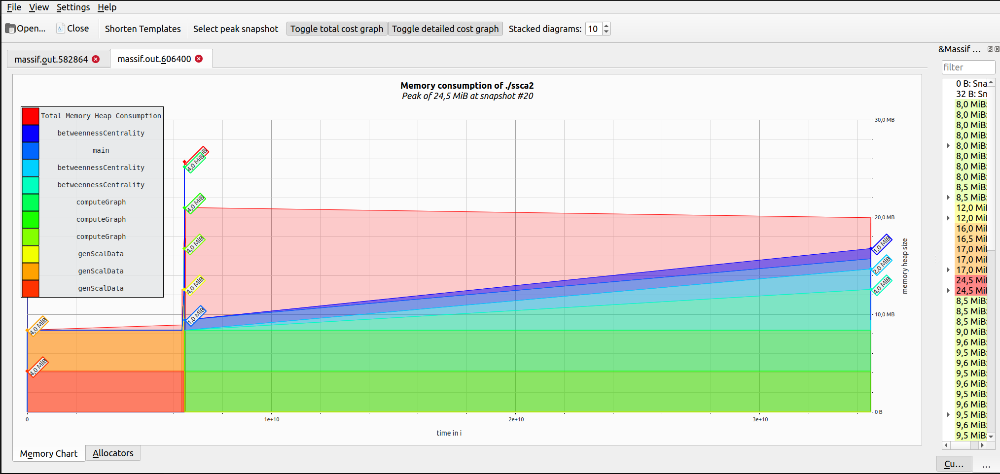

### Task 1

#### npb_bt_a

there are only 2 functions that allocate memory with the biggest one being IO_file_doallocate with kbyes while fopen only allocates 488 bytes of the heap

the time difference was a lot with npb_bt_a taking 10x as long and ssca2 about 3x

|          | massif    | -         |
|----------|-----------|-----------|
| npb_bt_a | 11m8.557s | 1m10.825s |
| ssca2 17 | 1m4.970s  | 32.458s   |

#### ssca2 17

in this program there is a lot more going on with 24,5 mbytes of total heap consumption at one point, and the genScalData, computeGraph and betweennessCentrality functions taking up 4 mbytes each

