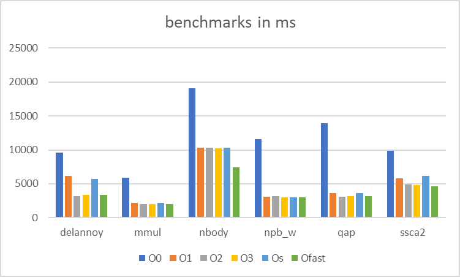

### Task 1

I had to extend my benchmarking setup sicne i was still building manually, so i added a build script and a superscript that executes multiple subscripts that are job scripts for each program, then those run a python benchmark script that runs each executable 5 times and benchmarkes it outputting a csv

i had to redo the whole thing because i used

cmake .. -G Ninja -DCMAKE_BUILD_TYPE=Release -DCMAKE_C_FLAGS="<flags>" but the build type release ignores the flags so i had to use -DCMAKE_C_FLAGS_RELEASE="<flags>" instead

i came to the following results, O0 being the slowest obviously, then O1-3 being icnreasingly faster, Os which is "Optimize for size. -Os enables all -O2 optimizations except those that often increase code size" lead to worse performance than O2, i guess with other types of programs it can lead to performance increases but not with ours

Ofast was the fastest

