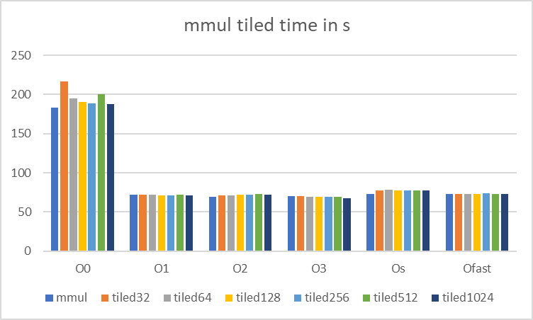

### Task 1

first i set the matrix size to 2048 in the #define, then i added loop tiling which divides nested loops into smaller blocks improving data locality by making the blocks fit into the cache, benchmarking took quite a long time and i only tiled the inner loop first not leading to any significant differences so i just tiled all loops 

```
for (int ii = 0; ii < N; ii += block_size)
{
    for (int jj = 0; jj < K; jj += block_size)
    {
        for (int i = ii; i < MIN(N, ii + block_size); i++)
        {
            for (int j = jj; j < MIN(K, jj + block_size); j++)
            {
                TYPE sum = 0;
                for (int kk = 0; kk < M; kk += block_size)
                {
                    for (int k = kk; k < MIN(M, kk + block_size); k++)
                    {
                        sum += A[i][k] * B[k][j];
                    }
                }
                C[i][j] = sum;
            }
        }
    }
}
```

we need a MIN in the loops that have M,N,K so we dont get out of the bounds of the matrix if it doesnt match the tile size perfectly

but still i dont not get any significant improvements/differences between tiling so i must have made a mistake somewhere



### Task 2

- get cache sizes for specific cpu
- allocate memory blocks with progressively larger sizes with atleast one fitting in each cache, clear cache for unbiased results
- access memory blocks multiple times sequentially
- measure access time for each block with appropiate time measurement
- results should show that at some point the block size exceedes the L1 cache so it gets put in the next cache etc